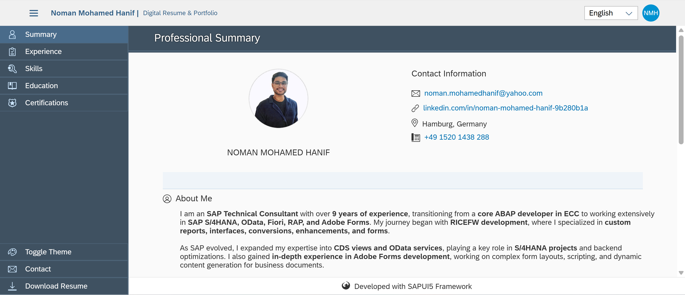

# Interactive UI5 Resume - Noman Mohamed Hanif

## Overview
This is an interactive, responsive resume application built using SAP UI5 framework. It showcases my professional experience, skills, and qualifications in a modern, interactive Fiori-style interface.



## Live Demo
Experience the interactive resume: [https://nomanmohamedhanif.github.io/ui5-resume/](https://nomanmohamedhanif.github.io/ui5-resume/)

## Features

- **Multilingual Support**: Available in English and German with automatic browser language detection
- **Responsive Design**: Optimized for desktop, tablet, and mobile devices
- **Interactive UI**: Fiori-style navigation and interactive elements
- **Theme Switching**: Toggle between light and dark themes
- **Modular Structure**: Based on SAPUI5 best practices with a clean MVC architecture
- **Markdown Support**: Resume content supports markdown formatting for rich text

## Technical Implementation

This resume application is built using:

- **SAPUI5/OpenUI5 Framework**: For the frontend UI components
- **MVC Pattern**: Model-View-Controller architecture
- **Responsive Design**: Adaptive UI for all device types
- **i18n**: Internationalization for multiple language support
- **GitHub Pages**: For hosting the static app

### Key UI5 Components Used

- `sap.f.DynamicPage` - For responsive page layouts
- `sap.tnt.ToolPage` - For the side navigation pattern
- `sap.f.ShellBar` - For the modern app header
- Various `sap.m` controls for content display

## Local Development

### Prerequisites
- Node.js and npm
- UI5 CLI (optional for local development server)

### Setup
1. Clone the repository:
```bash
git clone https://github.com/nomanmohamedhanif/ui5-resume.git
cd ui5-resume
```

2. Start a local server:
```bash
# If you have UI5 CLI installed
ui5 serve

# Alternatively, use any static file server like:
npx http-server
```

3. Open your browser at the indicated URL (typically http://localhost:8080)

## Project Structure

```
webapp/
├── controller/      # Application controllers
├── i18n/            # Internationalization files
├── Images/          # Image resources
├── model/           # Data models
│   └── mockdata/    # JSON data for the resume
├── view/            # UI views (XML format)
├── Component.js     # Main component
├── index.html       # Entry point
└── manifest.json    # Application descriptor
```

## Customization

To use this template for your own resume:

1. Update the `resume.json` file in `model/mockdata/` with your information
2. Replace images in the `Images/` directory
3. Adjust styling and layout as needed
4. Update i18n files if you want to support multiple languages

## Deployment

The application is deployed to GitHub Pages for easy access. To deploy your own version:

1. Push your changes to GitHub
2. Enable GitHub Pages in your repository settings
3. Your resume will be available at `https://[username].github.io/[repository]/`

## License

This project is open source and available under the [MIT License](LICENSE).

## Contact

Feel free to contact me for any questions or improvement suggestions:

- Email: noman.mohamedhanif@yahoo.com
- LinkedIn: [noman-mohamed-hanif-9b280b1a](https://linkedin.com/in/noman-mohamed-hanif-9b280b1a)